# Steganalysis with Deep Learning

> Master's thesis (TG2): detecting steganographic images with **CNN** and **Vision Transformer** models. The companion to [`steganography-toolkit`](https://github.com/sergioarojasm98/steganography-toolkit) — that repo *hides* data, this one *finds* it.

[](LICENSE)
[](https://www.python.org/)
[](https://www.tensorflow.org/)
[](https://pytorch.org/)
[]()
[]()

## Table of contents

- [Abstract](#abstract)
- [The bigger picture — a thesis trilogy](#the-bigger-picture--a-thesis-trilogy)
- [Dataset](#dataset)
- [Models implemented](#models-implemented)
- [Architecture of a single experiment](#architecture-of-a-single-experiment)
- [Results](#results)
- [Reproducibility](#reproducibility)
- [Repository structure](#repository-structure)
- [Limitations and honest disclosures](#limitations-and-honest-disclosures)
- [References](#references)
- [License](#license)
- [Author](#author)

## Abstract

Image **steganalysis** is the binary classification problem of deciding whether an image carries a hidden message embedded by a steganographic algorithm. This repository contains the implementation, training scripts, and experimental results for the second part of my MSc thesis in Artificial Intelligence at Pontificia Universidad Javeriana (Bogotá, Colombia). I trained and evaluated **two families of deep models** — convolutional neural networks (TensorFlow/Keras) and Vision Transformers (PyTorch) — to detect images modified by three different steganographic methods: **LSB**, **DCT**, and **DWT**. The models perform per-image binary classification (`original` vs. `stego`) and are evaluated both at the global level and broken down per embedding method.

The dataset combines hundreds of thousands of clean cover images with hundreds of thousands of stego variants generated by my own [`steganography-toolkit`](https://github.com/sergioarojasm98/steganography-toolkit), which makes the trilogy fully self-contained: I built the offense, I built the defense, and I measured how well one beats the other.

## The bigger picture — a thesis trilogy

This work is the second part of a research trilogy on image steganography:

1. **[`steganography-toolkit`](https://github.com/sergioarojasm98/steganography-toolkit)** *(TG1)* — implements the three embedding algorithms (LSB, DCT, DWT) used to generate the stego dataset.
2. **`steganalysis-deep-learning`** *(this repo, TG2)* — trains CNN and ViT models to detect those embeddings.
3. (Forthcoming/external) — paper, slides, and final thesis document.

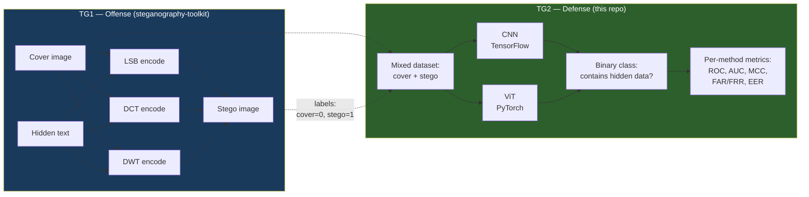

## Dataset

| Class | Source | Approx. count |
|---|---|---|
| Original (cover) | Public image corpora curated for the thesis | ~510,000 |
| Stego LSB | Generated with `steganography-toolkit` LSB encoder | ~638,000 |
| Stego DCT | Generated with `steganography-toolkit` DCT encoder | ~638,000 |
| Stego DWT | Generated with `steganography-toolkit` DWT encoder | ~638,000 |
| **Total** | | **~2.4 million images** |

The dataset is **not redistributed** in this repo (size + licensing). All images live on the on-prem GPU server "Cratos" used for training, under `/HDDmedia/srojas/`. To reproduce, you need to (a) build your own cover dataset and (b) generate the stego images with [`steganography-toolkit`](https://github.com/sergioarojasm98/steganography-toolkit).

The dataset is **class-imbalanced** (more cover than per-method stego in the training split), so all models use either weighted sampling or per-class loss weighting. PSNR analysis of the stego images for each method is included to characterize the visual fidelity of the steganographic outputs:

| LSB | DCT | DWT |
|---|---|---|
| 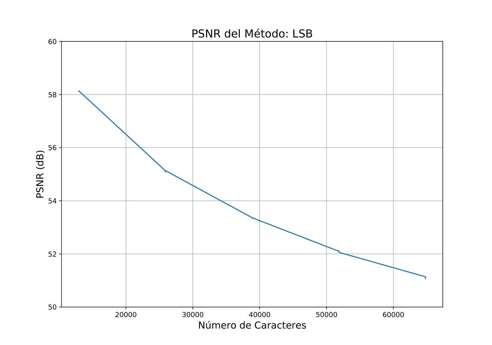 | 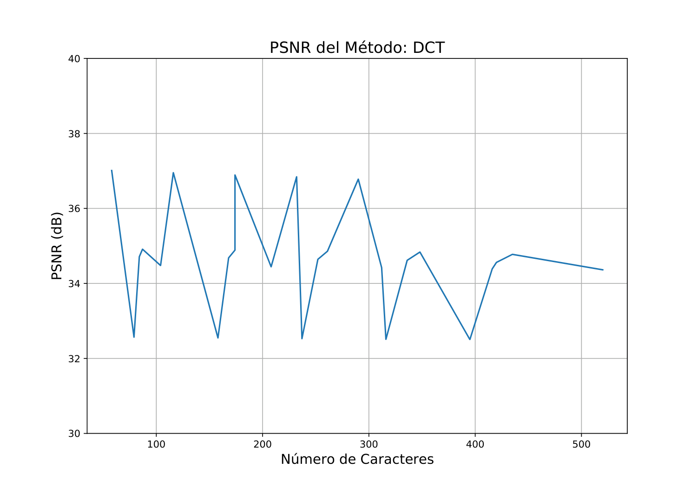 | 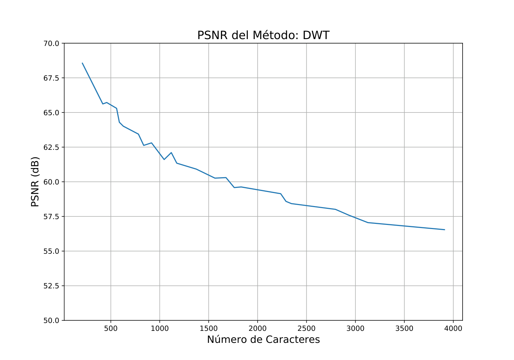 |

## Models implemented

| Script | Family | Framework | Architecture highlights | Optimizer |
|---|---|---|---|---|
| `CNN_Test_10.py` | CNN | TensorFlow/Keras | Sequential, 4 conv blocks, evaluation-only on a pre-trained checkpoint | Adam |
| `CNN_Test_11.py` | CNN | TensorFlow/Keras | Functional API, **skip connection from layer 1 to layer 4** | Adam |
| `CNN_Test_12.py` | CNN | TensorFlow/Keras | Functional API, **skip connection from layer 1 to layer 5** (wider feature span) | RMSprop |
| `ViT_Test_7.py` | Vision Transformer | PyTorch + `vit-pytorch` | `patch_size=20`, `depth=8`, `heads=32`, `dim=1024` | Adam |

The CNN scripts share a common skeleton: data loading + train/val/test split, multi-GPU training via `tf.distribute.MirroredStrategy` on the 8-GPU server, custom callbacks for Telegram notifications and checkpointing, and an end-of-run evaluation block that computes confusion matrices, ROC curves, FAR/FRR plots and the per-method breakdown. The ViT script uses `torch.nn.DataParallel` instead and is otherwise structured similarly.

**Design intuition for the skip connections.** Steganalysis is fundamentally a low-level statistical task: the clues that betray a hidden message live in the high-frequency residuals of the image, not in its semantic content. Early CNN layers tend to learn exactly those low-level filters, while late layers learn semantic abstractions that are mostly irrelevant for this task. Routing early feature maps directly into the classification head via a concatenation skip connection is the thesis's attempt to prevent those forensic cues from being washed out by deeper semantic pooling. Tests 11 and 12 differ in how deep that shortcut reaches (1→4 vs. 1→5), and Test 12 also swaps Adam for RMSprop to contrast optimizer behavior under the same objective.

**Training infrastructure.** Every CNN run spans 8 GPUs via `tf.distribute.MirroredStrategy`; the ViT run uses `torch.nn.DataParallel` for the same purpose. Each script wraps its training loop in a `try/except` block that forwards full tracebacks to a Telegram chat through a custom `send_telegram_message` helper, together with custom `EarlyStoppingNotification` and `CustomModelCheckpoint` callbacks. This was a deliberate choice because individual training runs are long enough that an overnight crash would otherwise go unnoticed until the next morning.

Older experiment iterations (Tests 1–9 for CNN, Tests 1–6 for ViT) live in `CNN.old/` and `ViT.old/` for academic provenance — they show the iteration history and are kept on purpose, not as dead code.

## Architecture of a single experiment

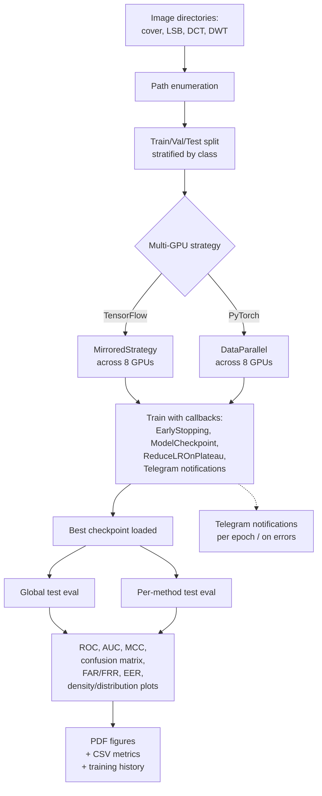

Each experiment script is **monolithic and self-contained** — data loading, model definition, training, evaluation, and result export all in one file. This is documented technical debt: the original intent was speed of iteration during the thesis, not reusability. See [Technical debt](#technical-debt) for the consequences.

## Results

> All figures are generated from the actual experiment runs. PDF originals are in `Resultados/`; PNG renders for this README are in `docs/figures/`.

### Best CNN model (`CNN_Test_12`)

The CNN with skip connections spanning layers 1–5 and the RMSprop optimizer was the best-performing convolutional model. Below are its global metrics across all three steganographic methods combined:

**Training history**

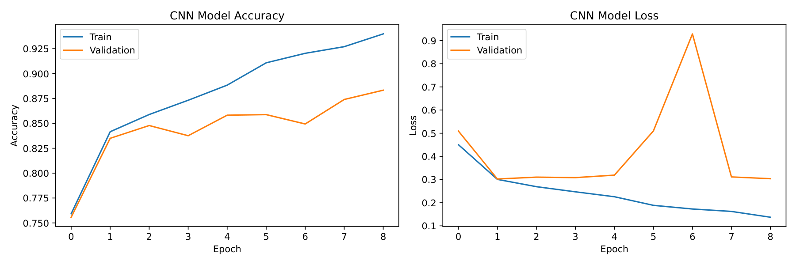

**Global ROC curve**

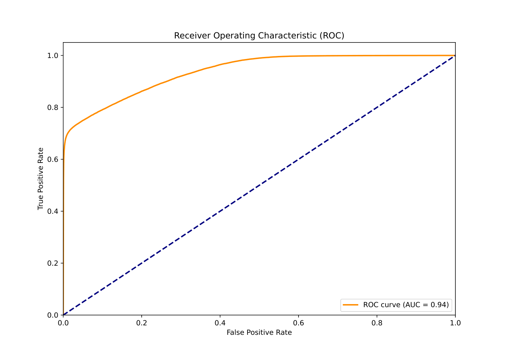

**Global confusion matrix**

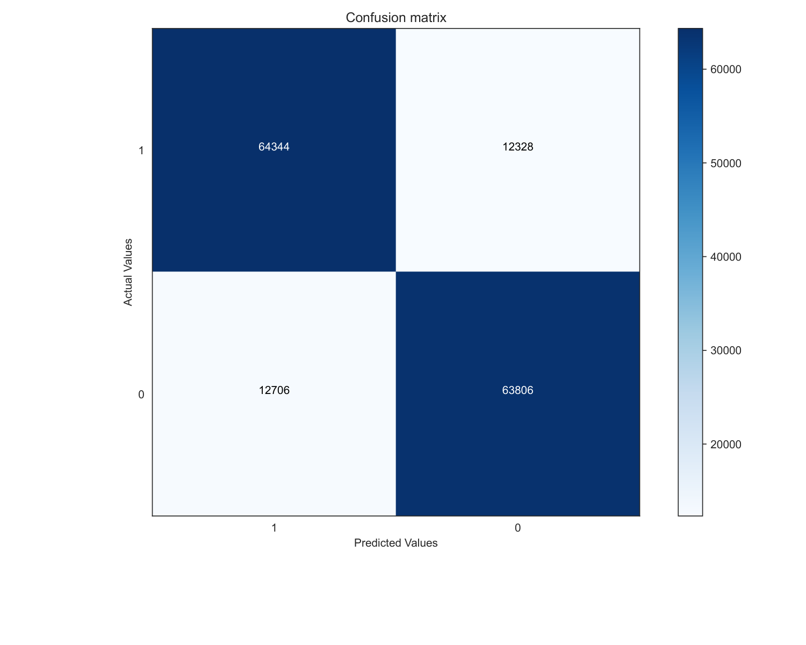

**FAR / FRR curves with EER point**

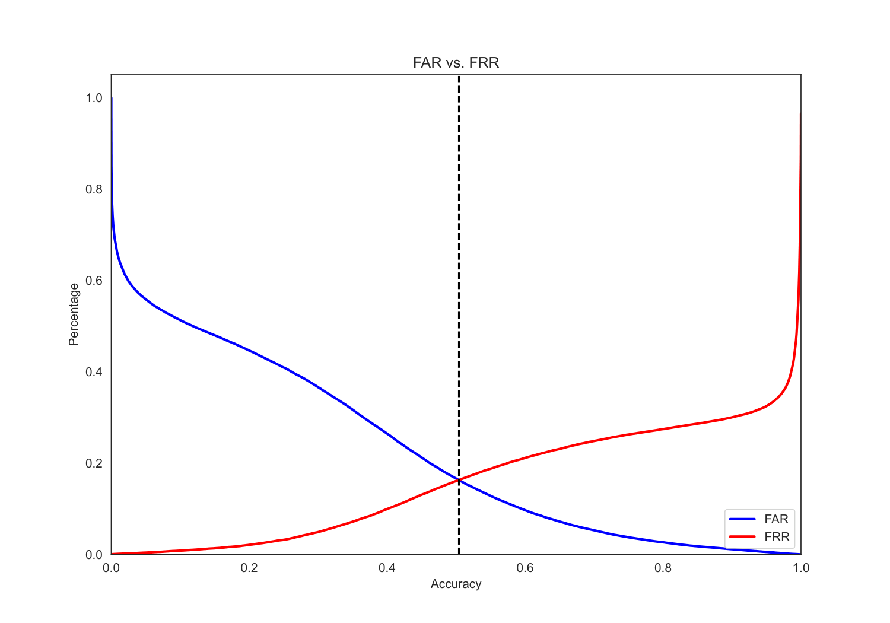

### Per-method breakdown (CNN Test 12)

How well does the same model detect each individual embedding technique?

| LSB | DCT | DWT |
|---|---|---|
| 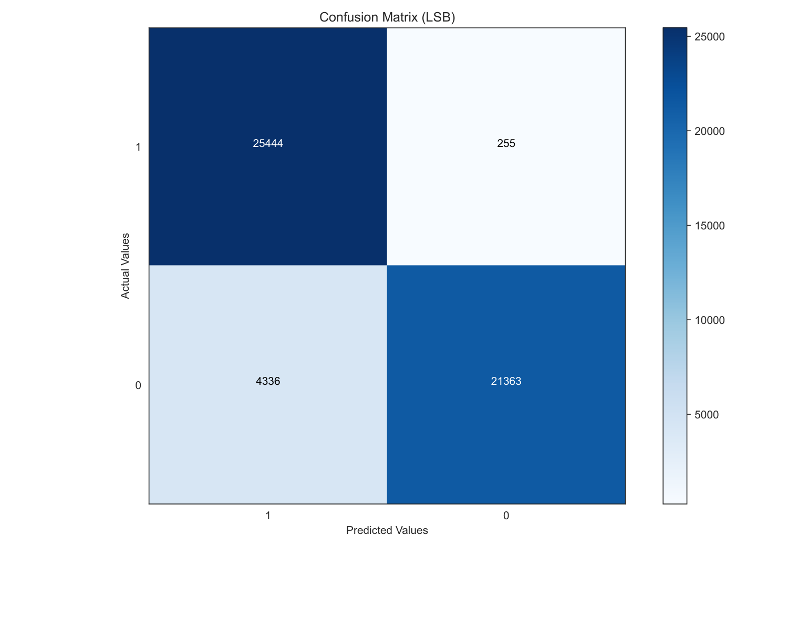 | 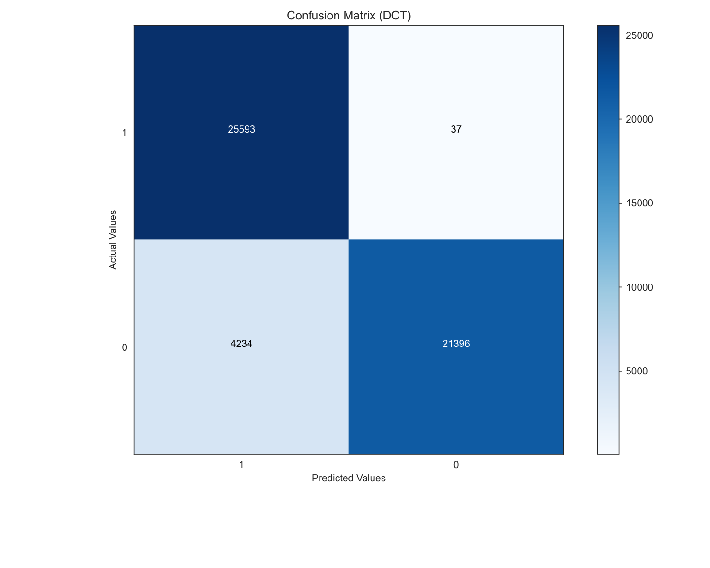 | 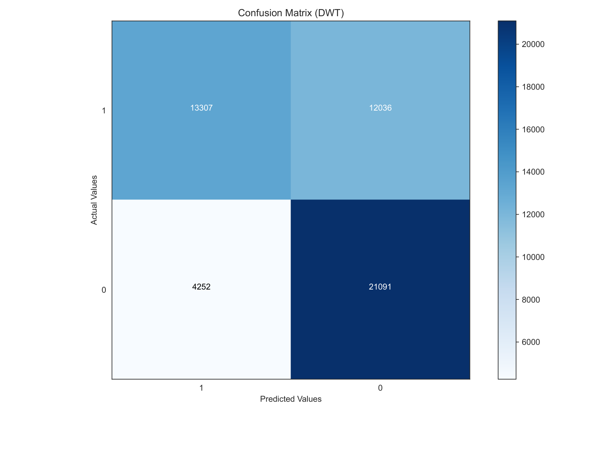 |

### Vision Transformer baseline

A direct ViT baseline (`ViT_Test_6`) was trained with `patch_size=20`, `depth=8`, `heads=32`, `dim=1024`:

**ROC curve**

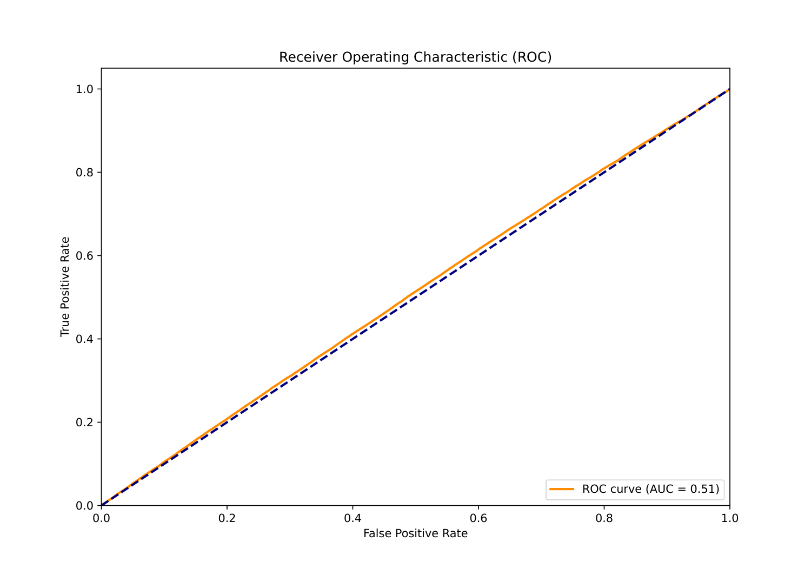

**Confusion matrix**

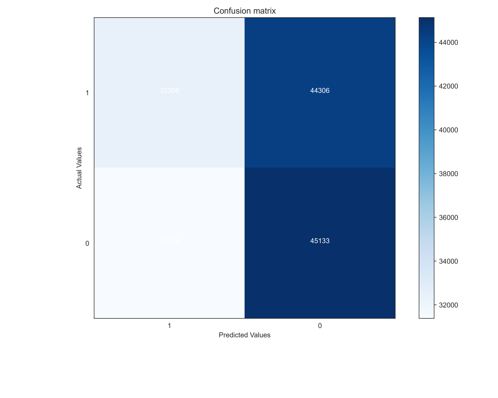

For full results across every test variant (10/11/12 for CNN, 1–7 for ViT, plus the per-method breakdown for each), explore the `Resultados/` directory directly — every figure is also exported as CSV under `Resultados/CSV_Files/` for downstream analysis.

## Reproducibility

> ⚠️ **Honest disclaimer**: this repo is research code, not a product. To run it end-to-end you need (a) one or more NVIDIA GPUs, (b) a cover-image dataset, and (c) the stego variants generated with [`steganography-toolkit`](https://github.com/sergioarojasm98/steganography-toolkit). The code is published for academic transparency. The reported results were trained on an 8-GPU on-prem server; the code itself works on smaller setups too.

### Quickest possible smoke check (no dataset, no GPU)

You can validate that the source code is intact without installing TensorFlow / PyTorch:

```bash
pip install -r requirements-dev.txt
pytest
```

This runs 26 sanity tests that verify the scripts parse, that the configurable-paths refactor is intact, that the silent-Telegram refactor never regresses, and that no leaked credentials remain in the source.

### Full environment (Anaconda — what was actually used)

The exact environment used to produce the published results is captured in [`stego-conda-venv-requirements.yml`](stego-conda-venv-requirements.yml):

```bash
conda env create -f stego-conda-venv-requirements.yml
conda activate stego
```

Key pinned dependencies: `python=3.10`, `tensorflow==2.14`, `pytorch==2.1`, `vit-pytorch`, `scikit-learn`, `matplotlib`, `seaborn`, `pandas`, `pynvml`, `requests`.

### Pip fallback (no Anaconda)

For environments where conda is not available:

```bash
pip install -r requirements.txt
```

Note: pip cannot reproduce the exact CUDA pinning of the conda env. You may need to install `tensorflow[and-cuda]` or a matching `torch` build for your CUDA version. The conda env is the recommended path.

### Running an experiment

```bash
# Optional: override the default paths if you keep dataset and outputs
# outside the repo. Defaults are TG2_HOME="." and TG2_DATA_ROOT="./data".
export TG2_HOME=/path/to/your/tg2/checkout
export TG2_DATA_ROOT=/path/to/your/dataset/root

# Train the best CNN model
python CNN_Test_12.py

# Train the ViT baseline
python ViT_Test_7.py
```

The dataset directory under `$TG2_DATA_ROOT` is expected to follow this layout:

```
$TG2_DATA_ROOT/
├── input-data/    # cover images
├── output-lsb/    # LSB stego (generated by steganography-toolkit)
├── output-dct/    # DCT stego (generated by steganography-toolkit)
└── output-dwt/    # DWT stego (generated by steganography-toolkit)
```

Models, results, and CSVs are written under `$TG2_HOME/Models/`, `$TG2_HOME/Resultados/`, and `$TG2_HOME/Resultados/CSV_Files/` respectively. With the default `TG2_HOME="."` they all land inside the repo checkout, which keeps experiments self-contained.

### Optional Telegram notifications

The training scripts can ping a Telegram chat on epoch end / errors. This is **completely optional and silent if not configured**. To enable, create `$TG2_HOME/Stuff/config.ini` with:

```ini
[Telegram]
apiToken = your_bot_token
chatID = your_chat_id
```

The file is gitignored. If it does not exist, every Telegram call inside the training scripts is a silent no-op — no warnings, no errors. CI runs with these credentials unset and never tries to reach Telegram.

## Repository structure

```
steganalysis-deep-learning/
├── CNN_Test_10.py                 # CNN, Sequential, evaluation-only baseline
├── CNN_Test_11.py                 # CNN, Functional API, skip connection 1->4, Adam
├── CNN_Test_12.py                 # CNN, Functional API, skip connection 1->5, RMSprop ⭐ best
├── ViT_Test_7.py                  # ViT, patch=20, depth=8, heads=32, dim=1024
├── CNN.old/                       # Archived CNN experiments (Tests 1-9)
├── ViT.old/                       # Archived ViT experiments (Tests 1-6)
├── Resultados/                    # Generated PDFs (ROC, confusion matrix, FAR/FRR, ...)
│   └── CSV_Files/                 # Generated CSV metric tables
├── Resultados.old/                # Archived CSV results from earlier iterations
├── ~temp/                         # Helper scripts (PSNR per method, GPU monitor, plotting)
├── logs/                          # Training output logs
├── docs/
│   └── figures/                   # PNG renders of key result PDFs (used in this README)
├── memory-bank/                   # Project context files (project-brief, tech-context, ...)
├── stego-conda-venv-requirements.yml
├── LICENSE
└── README.md
```

## Limitations and honest disclosures

For an archived research repository, a clear list of what the repo is *not* is often more useful than its list of features. Documented for transparency, not because any of these will be fixed:

- **Massive code duplication.** Plotting and metric functions are copy-pasted across `CNN_Test_10/11/12.py` and `ViT_Test_7.py`. Deliberate during experimentation so each script remained a self-contained record of one experiment, but a known maintenance liability.
- **No test suite.** No unit tests; the validation signal is the experimental metrics themselves.
- **No linter or formatter.** Code was not run through `black`, `ruff`, or similar.
- **Hardcoded path defaults.** Env vars now allow override (`TG2_HOME`, `TG2_DATA_ROOT`), but the defaults still point at the on-prem training server. Kept on purpose for academic provenance.
- **No `Dockerfile` / no pinned Linux deps.** Reproducing the exact training environment requires Anaconda + manual CUDA setup. There is no containerized version.
- **Spanish inline comments.** Inline comments inside the experiment scripts are in Spanish (the language the thesis was written in). Public-facing documentation, commit messages, file names and variable names are in English.
- **Mixed frameworks.** TensorFlow was chosen for the CNN side (for `MirroredStrategy`) and PyTorch for the ViT side (because `vit-pytorch` is PyTorch-only). The two pipelines are therefore not literally sharing code, only methodology.
- **No deployment.** No inference API, no web UI, and no saved-model loader for downstream use. Pretrained model weights are not redistributed.

## References

- **Steganalysis general**: Fridrich, J. (2009). *Steganography in Digital Media: Principles, Algorithms, and Applications*. Cambridge University Press.
- **CNN steganalysis foundations**: Qian, Y., Dong, J., Wang, W., & Tan, T. (2015). *Deep learning for steganalysis via convolutional neural networks*. SPIE Media Watermarking, Security, and Forensics.
- **Rich-model CNN**: Xu, G., Wu, H-Z., & Shi, Y. Q. (2016). *Structural design of convolutional neural networks for steganalysis*. IEEE Signal Processing Letters, 23(5), 708–712.
- **Vision Transformer**: Dosovitskiy, A. et al. (2021). *An Image Is Worth 16x16 Words: Transformers for Image Recognition at Scale*. ICLR. [arXiv:2010.11929](https://arxiv.org/abs/2010.11929)
- **TensorFlow**: Abadi, M., et al. (2016). *TensorFlow: A system for large-scale machine learning*. OSDI 2016.
- **PyTorch**: Paszke, A., et al. (2019). *PyTorch: An imperative style, high-performance deep learning library*. NeurIPS 2019.
- **vit-pytorch library**: Phil Wang's implementation — https://github.com/lucidrains/vit-pytorch
- **TensorFlow MirroredStrategy**: https://www.tensorflow.org/api_docs/python/tf/distribute/MirroredStrategy
- **Companion repo**: [`steganography-toolkit`](https://github.com/sergioarojasm98/steganography-toolkit) (TG1)

## License

[MIT License](LICENSE) — academic project, free to reuse for educational and research purposes.

## Author

[Sergio Rojas](https://github.com/sergioarojasm98) — Maestría en Inteligencia Artificial, Pontificia Universidad Javeriana de Bogotá. Trabajo de Grado 2 (TG2). The full thesis trilogy:

1. [`steganography-toolkit`](https://github.com/sergioarojasm98/steganography-toolkit) — TG1, the embedding algorithms
2. **`steganalysis-deep-learning`** — TG2, this repo, the detection models
3. Final thesis document — see academic publications

## Repository status

This repository is **archived**. It represents the code as delivered for the MSc thesis and is not under active development. Issues and pull requests will not be addressed. Forks are welcome under the MIT license — extend the work freely.
